Napisanie prostej strony internetowej nie jest trudnym zadaniem.
Jestem pewien, że z tym poradnikiem będziesz w stanie zbudować swoją pierwszą
statyczną stronę internetową w **HTML** i **CSS**.

W części pierwszej pobierzemy niezbędne narzędzia do pisania kodu, oraz stworzymy
strukturę plików naszej strony internetowej.

## Edytor: Visual Studio Code
Visual Studio Code to darmowy edytor kodu, który możemy dowolnie skonfigurować.
VSC posiada wszystkie funkcje, które pomogą Ci efektywnie tworzyć kod w wielu
językach. Kolorwanie składni, wcięcia czy wtyczki to główne zalety VSC.

Wejdź na stronę [https://code.visualstudio.com/](https://code.visualstudio.com/)
i pobierz plik instalacyjny.
Instalacja programu jest intuicyjna i prosta. Jedyna interakcja z Twojej strony
to zaakceptowanie umowy, jak w każdym procesie instalacyjnym.
Reszta to klikanie **dalej**, aby przejść do następnego okna.

Pobierz plik instalacyjny, zakładam, że większość osób korzysta z systemu Windows,
więc obrazki będą wyglądać podobnie.

Uruchom plik instalacyjny, powinieneś zobaczyć takie okienk, kliknij **Next >**
aby przejść do następnego kroku.

<div class="markdown-image">

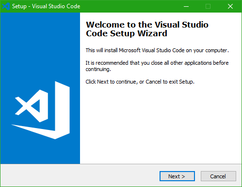

</div>

Zaakceptuj warunki licencji i kliknij **Next >**

<div class="markdown-image">

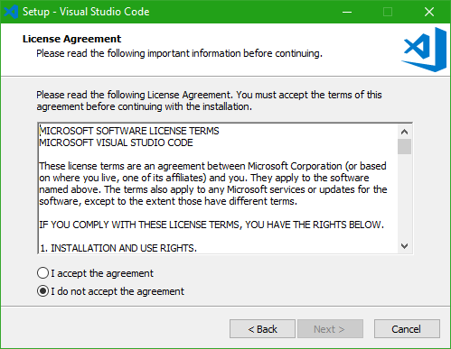

</div>

Wybierz folder w którym zainstalujesz program, zazwyczaj dysk C jest dobrym miejscem.

<div class="markdown-image">

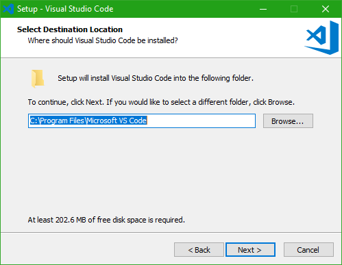

</div>

W tym kroku stworzymy folder w menu start, możesz również zaznaczyć na dole,
aby nie tworzyć dodatkowego folderu.

<div class="markdown-image">

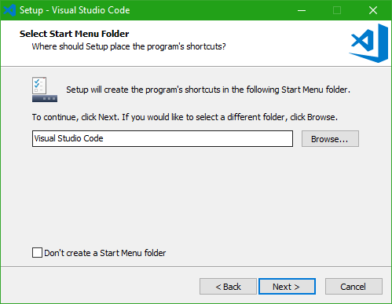

</div>

Teraz wybierz dodatkowe opcje, możesz stworzyć ikonę na pulpicie, oraz dodać
dodatkowe opcje po kliknięciu prawym przyciskiem myszy.

<div class="markdown-image">

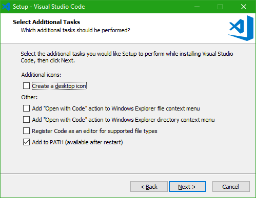

</div>

Po kliknięciu **Next >** program zacznie się instalować, usiądź wygodnie,
po chwili wszystko będzie gotowe.

Uruchom program, zobaczysz takie okno:
<div class="markdown-image">

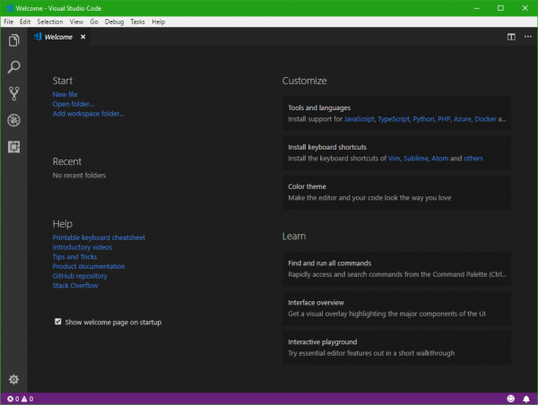

</div>

Brawo, zainstalowałeś Visual Studio Code!

Zainstalujemy teraz wtyczkę, która nazywa się **Live Server**.
Jest to wtyczka, która pozwoli na uruchomienie naszej strony internetowej
w przeglądarce.

Po lewej stronie programu znajdziesz ikony, kliknij w ostanią ikonę, jest to
miejsce gdzie instalujesz wtyczki.

<div class="markdown-image">

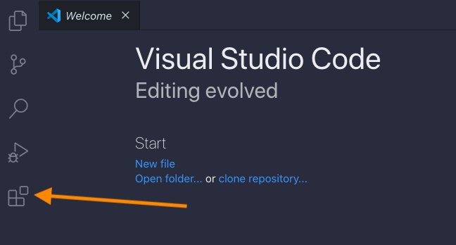

</div>

Wpisz **Live Server**, pierwsza pozycja to jest nasza wtyczka, kliknij.

<div class="markdown-image">

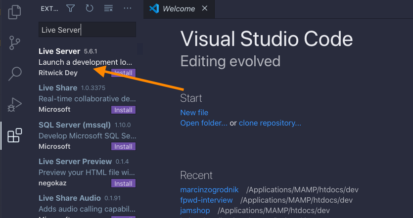

</div>

<div class="markdown-image">

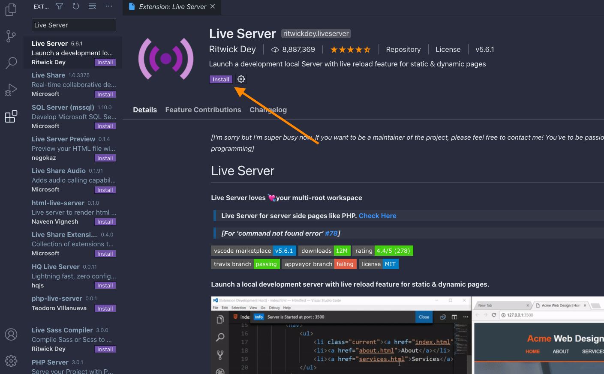

</div>

Kliknij **Install** aby zainstalować wtyczkę.
Wtyczka powinna zainstalować się w kilka sekund, już teraz możemy jej używać.

## Struktura projektu

Stwórz nowy folder o nazwie **strona-internetowa** na pulpicie (nazwa folderu
jest dowolna, możesz zmienić według upodobań).

Teraz w Visual Studio Code kliknij **File > Open Folder**, lub **File/Add Folder to Workspace**.

<div class="markdown-image">

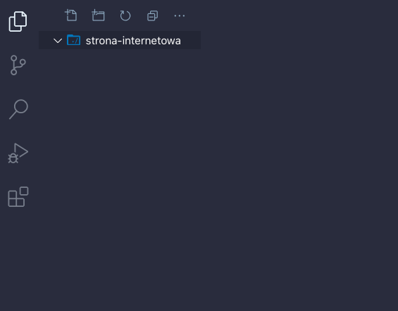

</div>

Nasz folder został dodany do VS Code, teraz możemy stworzyć nasz pierwszy plik **HTML**.

Aby dodać nowy plik, kliknij w ikonę jak na poniższym obrazku:

<div class="markdown-image">

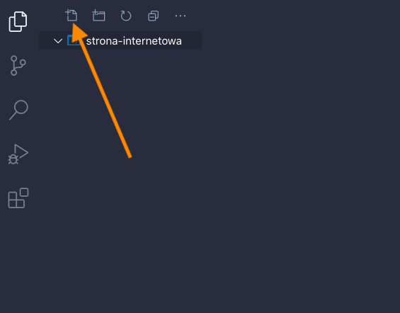

</div>

Nowy plik nazwij **index.html**.

Tak powinna wyglądać nasza struktura strony internetowej.

<div class="markdown-image">

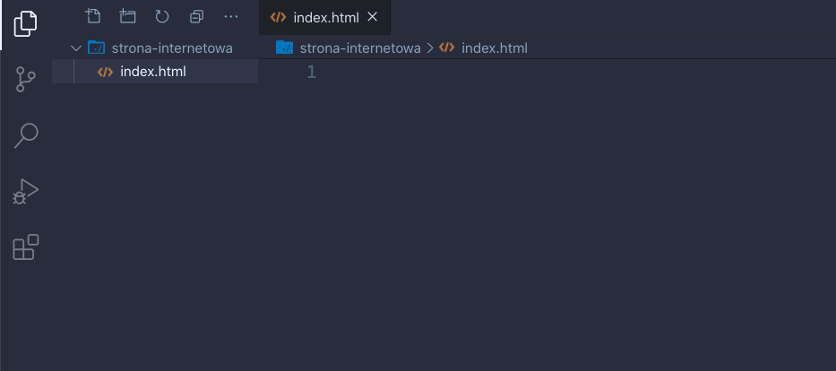

</div>

Teraz musimy stworzyć szkielet naszej strony, czyli podstawowy kod, który
jest używany na każdej stronie internetowej.

Skopiuj poniższy kod i wklej go do pliku **index.html**.

```
<!DOCTYPE html>
<html lang="en">
<head>
  <meta charset="UTF-8">
  <meta name="viewport" content="width=device-width, initial-scale=1.0">
  <title>Strona Internetowa</title>
</head>
<body>

</body>
</html>
```

<div class="markdown-image">

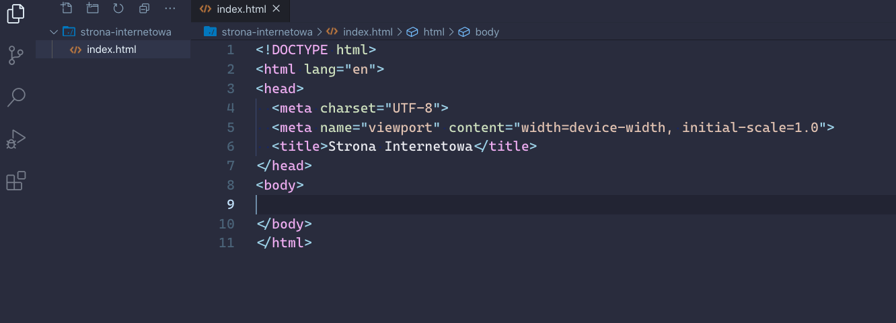

</div>

Pomiędzy ```<title></title>``` wpisz tytuł swojej strony, będzie ona widoczna
na pasku w przeglądarce.

Nasza strona internetowa już istnieje, jednak jest pusta, nie ma jeszcze żadnej
zdefiniowanej treści.

Elementy na stronie dodajemy pomiędzy znacznikami ```<body></body>```.

### Live Server
Teraz jest dobry czas, aby uruchomić wtyczkę **Live Server**.
Na dole, po prawej stronie znajdź **Go Live**.

Automatycznie otworzy się nowa karta w przeglądarce z naszą stroną internetową.

<div class="markdown-image">

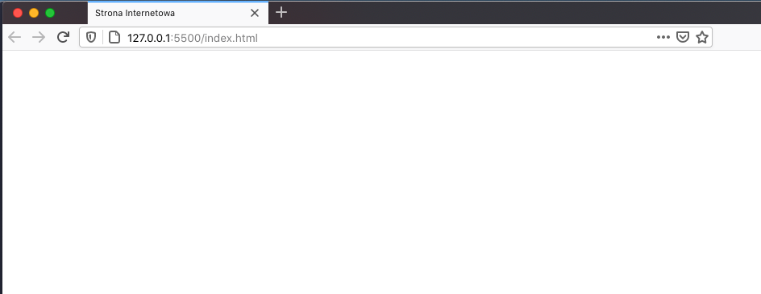

</div>

Od teraz wszystkie zmiany, które zapiszemy zostaną automatycznie wyświetlone
w przeglądarce, prawda, że proste?

Dodajmy więc tekst na naszą stronę, aby zobaczyć czy działa.

Stwórzmy nagłówek **H1** w naszym kodzie, pomiędzy znacznikami **body**.

```
<h1>Moja pierwsza strona internetowa</h1>
```

<div class="markdown-image">

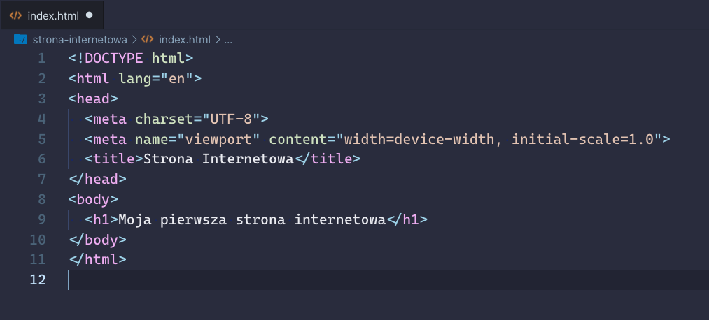

</div>

Teraz sprawdź przeglądarkę, zobaczysz nasz nagłówek na stronie internetowej!

<div class="markdown-image">

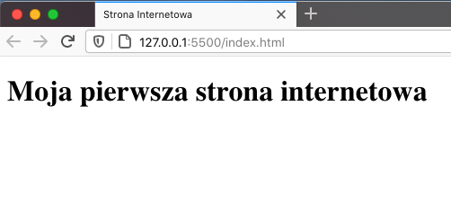

</div>

Podstawy języka **HTML** znajdziesz [tutaj](https://developer.mozilla.org/pl/docs/Learn/Getting_started_with_the_web/HTML_basics). Poczytaj jakie są najpopularniejsze tagi,
oraz jak powinno się tworzyć czysty kod.

To wszystko w części pierwszej, w kolejnej części dodamy troszkę kolorków oraz
ładnie wszystko ułożymy na stronie.


**Wesołych Świąt!**